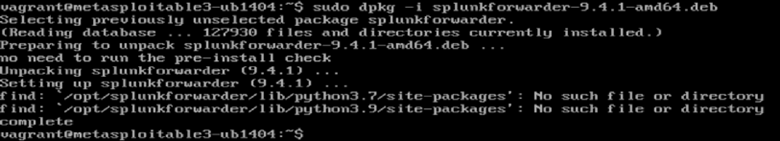

# Phase 2: Splunk Forwarder Integration

This phase demonstrates the process of setting up **Splunk Universal Forwarder** on the Metasploitable3 machine and forwarding logs to **Splunk Enterprise** running on Kali Linux. The steps include installation, configuration, and verification of successful log ingestion.

---

## Step 1: Download and Install Splunk Forwarder on Metasploitable

### 1. Download the Splunk Forwarder `.deb` Package

### 2. Install the Package

### 3. Start Splunk Forwarder and Accept the License

### 4. Enable Splunk Forwarder to Start on Boot

---

## Step 2: Configure the Forwarder to Send Logs

### 1. Add the Splunk Indexer (Kali Machine) as the Receiving Target

### 2. Add Log File for Monitoring (`/var/log/auth.log`)

---

## Step 3: Configure and Launch Splunk Enterprise on Kali Linux

### 1. Start Splunk Enterprise on Kali

### 2. Configure Splunk to Listen on Port `9997` for Incoming Logs

---

## Step 4: Final Steps and Verification

### 1. Restart Splunk Forwarder on Metasploitable

### 2. Confirm Logs Are Received and Indexed

### 3. Visualize and Analyze the Collected Logs

### 4. Verify the Logs on Metasploitable Are Consistent

The logs displayed in Splunk on Kali match those on the Metasploitable machine, confirming that log forwarding has been successfully configured and is working as intended.

---

## Conclusion

In this phase, we successfully:
- Installed and configured Splunk Universal Forwarder on Metasploitable.
- Set up log forwarding to a Splunk Enterprise instance on Kali Linux.
- Verified the complete pipeline from log generation to visualization.

This setup enables real-time log collection and monitoring from the target machine, which is essential for security event analysis.
