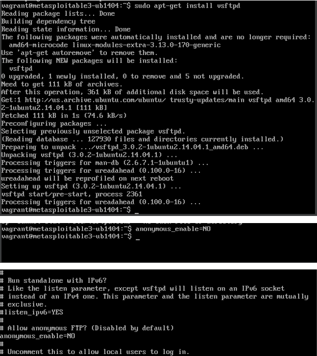
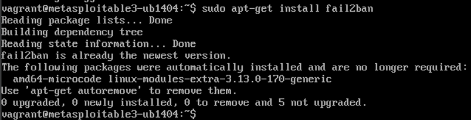
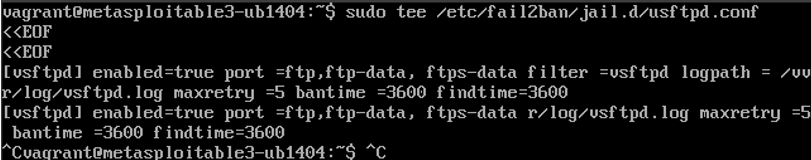

# Phase 3: This phase focuses on mitigating the vulnerabilities identified in earlier phases by implementing security hardening measures such as disabling anonymous FTP access, deploying intrusion prevention (Fail2Ban), and enforcing application confinement (AppArmor).
# Phase 3 work:
## Step 1-  Disable Anonymous FTP Login
Objective : Prevent unauthorized access via anonymous FTP login.
sudo apt-get install vsftpd
This replaces the default FTP service (proftpd) with vsftpd, a more secure alternative.

Modify vsftpd Configuration :
Edit /etc/vsftpd.conf:
anonymous_enable=NO  
Disables anonymous login (critical for preventing unauthorized access).

### Step 2- Deploy Fail2Ban for Brute-Force Protection:
Objective : Automatically block IPs after repeated failed login attempts.

1. Install Fail2ban:

2. Create a Custom Jail Configuration :

Edit /etc/fail2ban/jail.d/vsftpd.conf:

Blocks IPs after 5 failed attempts for 1 hour.
