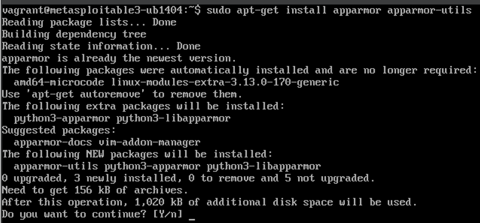
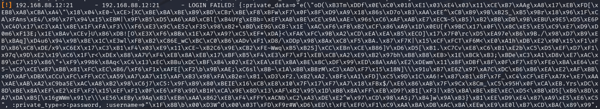
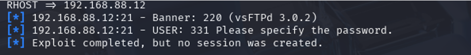

# Phase 3: This phase focuses on mitigating the vulnerabilities identified in earlier phases by implementing security hardening measures such as disabling anonymous FTP access, deploying intrusion prevention (Fail2Ban), and enforcing application confinement (AppArmor).
# Phase 3 work:
## Step 1-  Disable Anonymous FTP Login
Objective : Prevent unauthorized access via anonymous FTP login.
sudo apt-get install vsftpd
This replaces the default FTP service (proftpd) with vsftpd, a more secure alternative.

Modify vsftpd Configuration :
Edit /etc/vsftpd.conf:
anonymous_enable=NO  
Disables anonymous login (critical for preventing unauthorized access).

## Step 2- Deploy Fail2Ban for Brute-Force Protection:
Objective : Automatically block IPs after repeated failed login attempts.

1. Install Fail2ban:

2. Create a Custom Jail Configuration :

Edit /etc/fail2ban/jail.d/vsftpd.conf:

Blocks IPs after 5 failed attempts for 1 hour.

3. Restart Fail2Ban:
   sudo service fail2ban restart

## Step 3- Deploy AppArmor for Application Confinement:
Objective : Restrict vsftpd system calls and filesystem access.

1. Install AppArmor Tools:
  sudo apt-get install apparmor apparmor-utils

2. Enable AppArmor Profile for vsftpd :
Puts AppArmor in "enforce" mode for vsftpd.

## Step 4- Re-Run Exploits to Confirm Mitigations:
Objective : Verify that the implemented security measures prevent exploitation.

Test 1: Brute-Force Attack via msfconsole

use auxiliary/scanner/ftp/ftp_login  
set RHOST 10.0.2.7  
set USER_FILE /usr/share/wordlists/rockyou.txt  
set PASS_FILE /usr/share/wordlists/rockyou.txt  
run  

Result :
Login Failed due to disabled anonymous access and AppArmor restrictions.

Test 2: Backdoor Exploit (vsftpd_234_backdoor)

use exploit/unix/ftp/vsftpd_234_backdoor  
set RHOST 192.168.88.12  
exploit  

Exploit Fails : No session created (no backdoor listener on port 6200).

## Step 5-Confirm No Backdoors Exist:

Output : No active connections on port 6200.

## Step 6-Validate Splunk Integration:
Objective : Ensure logs from the victim machine are forwarded to Splunk.
Splunk Dashboard :
Shows successful and failed login attempts from the victim machine.

